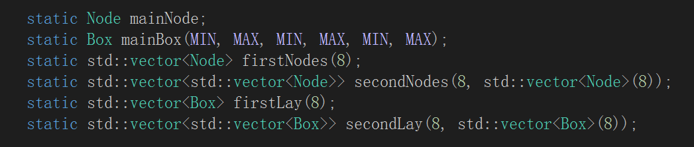

# What I have implemented
## Step1-intersection function
### 1.Triangle intersection
In this function I used my own way to detect the intersection. 
First I check if the dirction of the ray is parallel with the triangle(perpendicular with the normal), if so, return false. 
Second, if not parallel, that means the ray is definitely hit somewhere on the plane where the triangle is, we call the point p. In this case, vector ap/bp/cp should be perpendicular to the normal, then Iget the t value. 
Then, I examine if p is inside the triangle. If it is, vector ap and ac are at the same side of ab, so cross(ap,ab)*cross(ac,ab)>0, and so on. After 3 checkings, if all true, then set the hitrecord and return true.

### 2.Sphere intersection
If p is on the sphere, length of cp is definitely rad. So I check if the quadratic equation has answers, or has only one answer(I assume the tangent occasion as miss). If it has 2 answers, I choose the smaller t, as it is in the front. 
After checking if it is valid, I set the hitrecord and return true.

### 3.Check what the ray hits
Traverse all surfaces, and choose the one with the smallest t to be hr.

## Step2-Shading
When the ray from the camera hits something, using the original Phong BRDF model, I can calculate the color of the hitten point. The color composes of diffuse reflection and specular reflection. In this assignnment I ignore the ambient 
part as there is no environmental effect. I send out a ray towards each light source, if it is not blocked, I calculate each vectors (as shown in the graph below), and get the 
color = max(cos(I,n),0)*lightcolor*fillcolor*kd+max(cos(v,r),0)*lightcolor*fillcolor*ks.

## Step3-Checking shadows
When I send out a ray towards each light source, traverse all the objects to see if the ray hit anything between the hitten point and the light source. If it dose, skip the shading part, so that it appearces to be in a shadow.

## Step4-Calculating reflection
In this part I use recursive function. When I finished calculation of the first point, let it be the new eye, and send out a ray towards the reflection direction. If it hits something, 
I do all the process again, and add up to the color of the first point. By this way, I can do reflection calculating no matter how many times I want, just let trace function call shade function, and shde function call trace function again after shading 
is done. However, to make sure the process ends, I set a variable c, c++ when a cycle is done. When c equals maxraydepth, return black color and end. And when c is not up to maxraydepth, but a ray hit nothing in trace function, return black 
color and end as well. Specially when the first ray hit nothing, return background color.

## Bounding box accelerating
### 1.New class and struct
I created a Box class and a Node struct. The Box class contains six xyz value of the coordinate of six surfaces. As the box is horizontal, I don't need specific coordinates of eight points. The Box class also has a vector<int> called "intersectList" for all the surface index intersect with it. The Node struct contains a pointer to a box and eight pointers for eight son nodes.

### 2.Data structure
The boxes are in three levels, the mainBox covers everything in the scene, I divide it into 8 congruent rectangulars, and put them in a vector<Box> called "firstLay". 
The boxes in "firstLay" are further divided into 8 congruent smaller boxes, and put them in a 2d vector<Box>, so there are overall 64 small bounding boxes that contain different objects. 
In the same way, the mainNode has a pointer to the main box and eight pointer to eight son nodes(also in a vector<node> called "firstNodes"). Each son node has a pointer to a box in "firstLay". and eight pointers to eight grandson nodes(also in a 2d vector<Node>), which are all correspondent to 64 smallest bounding boxes.  

On the whole, the tree structure is convenient in searching what a ray hit, I can search layer after layer, and save time from unnecessary searches. 
But the reason why a put all the boxes and nodes in a same level in a vector is that its more flexible in initializing and checking, without naming every one of them.
  
  More details are shown in the graph below. 
  
  Before I start tracing, Igo through all objects to locate the mainBox, and divide it layer after layer, save the smaller boxes in vectors and nodes, and complete the tree structure. Then I go through all objects to record them in intersectLists in every boxes they're in.
  
### 2.More functions
#### (1)checkPosition
  This is the function for positioning the mainBox. I go through all surfaces to check the biggest and smallest xyz value, and let them be positions of the six surfaces of the mainBox.
#### (2)seperate
  This is the fuction to divide a box in a node and initial them into eight son boxes in eight son nodes, and initial eight son pointers in father node.
#### (3)boxIntersect
  This is a function checking if an object is intersect with a box.
  
  Spere::boxIntersect() is designed to check if the center of the sphere is inside the range of the box  a radius wider in all six directions.
  
  Triangle::boxIntersect() is designed to biuld the smallest rectangular around the triangle with its biggest and smallest xyz values. And check if the two rectangulars intersect.
  
  TrianglePatch::boxIntersect() is the same way as Triangle::boxIntersect().
  
  Note that all boxIntersect function are not absoletely precise. Some objects that do not intersect with a certain box but close to it may also be judged to be intersected. There is nothing wrong with it, as to precisely check if a triangle or sphere is intersect with a box is relatively complicated and unecessary. Having possibly multiple checks in one objects saves more time than to check whether it intersect with a box or not. All I have to do is to record all objects in potential boxes.
#### (4)Box::Intersect
  This is the function to see if a ray hits a box.
  I simply let ray hit on the plane of six surfaces of the box(three sets of parallel planes), and get three sets of corresponding t values, as the graph demonstrates below. Here I simply ignore the situation when the ray is parallel to a set of planes as it is almost impossible. The biggest t value of three smallest xyz surfaces is supposed to be tmin, and the smallest t value of three biggest xyz surfaces is supposed to be tmax. If tmax does exceeds tmin, the ray hits the box. But considereing the starting point may be inside the box, I check if tmax is in the range of t0 and t1, if true, return true.

### 3.Accelerating strategy
  After data structure is biult. Whenever I need to go through everything to find out what a ray hits, I check if it hits the mainBox first. If it does, check the eight son boxes one by one, if the ray hits some of them, continue to check their sons. If the ray hits some boxes it the last layer, collect their "intersectList" in a new vector. Then I go through the new vector full of potential hitten objects, instead going through every object.

## Step5-Calculating refraction
### 1.Getting refraction light
  According to Snell's Law， sin(theta1)/sin(theta2) is equal to oir2/oir1. So I can easily get the direction of refraction light according the ray, the normal of the surface and oir of the surface. 
  But the problem is to check whether the ray is entering or exiting. As all surfaces of an object are designed to have normals towards the ouutside, as long as we calculate the cross-product value in the same order. So I calculate the dot-product value between normal and the direction of the ray, if it is negative, it's entering, and if it's positive, it's exiting.
### 2.Recursive algorithm
  Similar as step4, after geting the original color of the surface, I send out a refraction light, call trace function again to trace the refraction light and finally get the refraction color.
### 3.The proportion of reflect and refract
  According to Snell's Law and Schlick Approximation, I can get the proportion of reflection in all light, using oir of the surface and angle of incidence. Add up the reflection and refraction color in the right proportion, I can get the final color.
  
  
  
  
